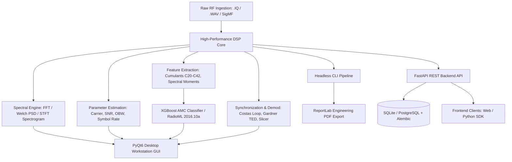

# SignalInsight 📡

**Automated IQ/WAV Signal Analysis, Parameter Extraction & Modulation Classification**

[](https://www.python.org/downloads/)
[](https://fastapi.tiangolo.com/)
[](https://www.riverbankcomputing.com/software/pyqt/)
[](https://xgboost.readthedocs.io/)
[](https://github.com/sonu-dops/sih2026147)

SignalInsight is a production-grade RF engineering and signal intelligence instrument. It provides laboratory-grade DSP, deep parameter extraction, automatic modulation classification (AMC) powered by machine learning, an interactive desktop workstation GUI, a headless CLI, and a high-performance FastAPI microservices backend.

---

## 📑 Table of Contents

- [System Architecture](#system-architecture)
- [Key Features](#key-features)
- [Repository Structure](#repository-structure)
- [Installation & Setup](#installation--setup)
  - [Prerequisites](#prerequisites)
  - [Windows Setup](#windows-setup)
  - [macOS Setup (Apple Silicon & Intel)](#macos-setup-apple-silicon--intel)
  - [Linux (Ubuntu / Debian) Setup](#linux-ubuntu--debian-setup)
- [How to Use](#how-to-use)
  - [1. Launching the Interactive GUI Workstation](#1-launching-the-interactive-gui-workstation)
  - [2. Headless CLI Analysis & PDF Generation](#2-headless-cli-analysis--pdf-generation)
  - [3. Running the FastAPI Backend Server](#3-running-the-fastapi-backend-server)
  - [4. Training AMC Models & Managing Datasets](#4-training-amc-models--managing-datasets)
  - [5. Using API Clients (Python & TypeScript)](#5-using-api-clients-python--typescript)
  - [6. Running Automated Tests](#6-running-automated-tests)
- [Team Member Guide & Workflows](#team-member-guide--workflows)
- [Troubleshooting & FAQs](#troubleshooting--faqs)
- [License & Contributing](#license--contributing)

---

## 🏗️ System Architecture



---

## ⚡ Key Features

- **Multi-Format Ingestion**: Ingests raw `.IQ` binary recordings (with support for `int8`, `uint8`, `int16`, `uint16`, `int32`, `float32`, `float64`, `IQ`/`QI` interleaving, little/big endian), standard and RF floating-point `.WAV`, and **SigMF** metadata archives.
- **Scientific Provenance**: Complete traceability of all measurements. Parameters are explicitly tagged with their source (`[SIGMF]`, `[USER]`, `[ESTIMATED]`, `[CALCULATED]`, or `[CALIBRATION_REQUIRED]`) and numerical confidence levels.
- **High-Performance Memory Mapping**: Employs `numpy.memmap` and chunked streaming to handle multi-gigabyte recordings smoothly without blocking the UI or overflowing system RAM.
- **Rigorous DSP Engine**:
  - DC offset removal (mean and complex).
  - Normalization (RMS, Peak, or Uncalibrated absolute).
  - Analytic signal construction via Hilbert transform with boundary effect mitigation.
  - Numerically stable instantaneous amplitude, phase unwrapping, carrier detrending, and Savitzky-Golay smoothed instantaneous frequency.
  - Windowed FFT (Rectangular, Hann, Hamming, Blackman, Flat-top) and Welch PSD (dB/Hz).
  - Short-Time Fourier Transform (STFT) 2D Spectrogram.
- **Parameter Estimation**:
  - Baseband & RF Carrier frequency estimation with spectral peak interpolation.
  - Occupied Bandwidth (OBW at 90%, 95%, 99%) and -3 dB / -6 dB power thresholds.
  - Percentile and median noise floor estimation; in-band integrated SNR.
  - Multi-method Symbol Rate estimation (cyclostationary, transition timing, spectral autocorrelation).
- **Comprehensive Feature Extraction**:
  - Time-domain and envelope statistics (RMS, Crest factor, Skewness, Kurtosis, Zero-crossings).
  - Higher-Order Cumulants: $C_{20}, C_{21}, C_{40}, C_{41}, C_{42}$ and normalized invariants $f_{40}, f_{41}, f_{42}$.
  - Spectral moments (centroid, spread, skewness, kurtosis, flatness).
  - IQ imbalance (amplitude and phase imbalance metrics).
- **Automatic Modulation Classification (AMC)**:
  - Gradient-Boosted (`XGBoost`) classifier trained on invariant statistical and cumulant features.
  - Benchmark accuracy on **DeepSig RadioML 2016.10a** and synthetic impairments.
  - Supported modulation classes: `BPSK`, `QPSK`, `8PSK`, `16-QAM`, `FSK`, `AM-DSB`, `AM-SSB`, `WBFM`, `CPFSK`, `GFSK`.
  - Rejection thresholding: low-confidence classifications are reported as `UNCERTAIN`.
- **Synchronization & Demodulation**:
  - Matched filtering (Root-Raised Cosine and Raised Cosine).
  - Carrier phase & frequency recovery (Costas loop).
  - Symbol timing recovery (Gardner timing error detector).
  - Modular demodulators (BPSK, QPSK, 8PSK, 16-QAM, FSK) with Gray mapping, constellation display, and RMS EVM metrics.
- **Professional Desktop UI**:
  - PyQt6 + PyQtGraph professional light and dark engineering workstation themes.
  - Dockable panels: Workspace Explorer, Properties Inspector, Analysis Control, Results Summary, Markers Manager, Message Console, and Processing Queue.
  - Interactive plot cursors, peak/delta markers, and level-of-detail decimation for large recordings.
- **FastAPI Microservices Backend**:
  - Full REST API for signals, projects, analysis jobs, AMC model registry, and reports.
  - Database persistence via SQLAlchemy and Alembic migrations.
  - TypeScript frontend API client and Python SDK client (`signalinsight.api_client`).

---

## 📂 Repository Structure

```text
.
├── backend/                  # FastAPI Microservices Backend
│   ├── alembic/              # Database migration scripts
│   ├── app/
│   │   ├── api/v1/           # REST endpoints (signals, jobs, amc, models, etc.)
│   │   ├── config.py         # App settings & storage directories
│   │   ├── db/               # SQLAlchemy models & repositories
│   │   ├── schemas/          # Pydantic request/response schemas
│   │   ├── seed/             # Seed scripts for demonstration data
│   │   ├── services/         # Business logic layer
│   │   └── storage/          # Local file storage handlers
│   └── tests/                # Backend unit & integration tests
├── data/                     # Local data root (signals, models, reports, cache)
│   ├── models/               # Trained AMC models (e.g., amc_xgboost_radioml.json)
│   └── signals/              # Raw IQ & WAV sample files with catalog
├── frontend/                 # Frontend client workspace
│   └── src/api/              # TypeScript REST API client
├── samples/                  # Built-in lightweight test fixtures (demo_qpsk.wav)
├── signalinsight/            # Core Python Library & Desktop Application
│   ├── amc/                  # AMC feature extraction, training & dataset manager
│   ├── api_client/           # Python SDK client for backend API
│   ├── core/                 # Signal models, constants, and logging
│   ├── dsp/                  # Digital Signal Processing routines
│   ├── estimation/           # Carrier, bandwidth, SNR, and symbol rate estimation
│   ├── io/                   # IQ, WAV, and SigMF loaders/writers
│   ├── pipeline/             # Multi-stage automated analysis pipeline & workers
│   ├── reporting/            # Multi-page PDF report generation
│   └── ui/                   # PyQt6 Desktop Workstation GUI & views
├── signals/                  # Additional reference recordings and catalog
├── tests/                    # Core library DSP & UI test suite
├── pyproject.toml            # Project packaging and dependency specifications
└── requirements.txt          # Frozen pip dependencies
```

---

## 💻 Installation & Setup

### Prerequisites

- **Python 3.10, 3.11, or 3.12** (Python 3.10+ is strictly required).
- **Git** installed on your system.

---

### Windows Setup

1. **Clone the repository**:
   ```powershell
   git clone https://github.com/sonu-dops/sih2026147.git
   cd sih2026147
   ```

2. **Create and activate a virtual environment**:
   ```powershell
   python -m venv .venv
   .\.venv\Scripts\Activate.ps1
   ```
   *(If script execution is disabled, run `Set-ExecutionPolicy -Scope Process -ExecutionPolicy Bypass` in PowerShell).*

3. **Install dependencies and editable package**:
   ```powershell
   python -m pip install --upgrade pip
   pip install -r requirements.txt
   pip install -e .
   ```

---

### macOS Setup (Apple Silicon & Intel)

> [!IMPORTANT]
> On macOS, especially Apple Silicon (M1 / M2 / M3 / M4), the `xgboost` package requires OpenMP (`libomp`). Additionally, PyQt6 runs natively using Cocoa. Follow the steps below for a seamless experience.

1. **Install Homebrew** (if not already installed):
   ```bash
   /bin/bash -c "$(curl -fsSL https://raw.githubusercontent.com/Homebrew/install/HEAD/install.sh)"
   ```

2. **Install Python & OpenMP via Homebrew**:
   ```bash
   brew update
   brew install python@3.10 libomp
   ```

3. **Clone the repository**:
   ```bash
   git clone https://github.com/sonu-dops/sih2026147.git
   cd sih2026147
   ```

4. **Create and activate virtual environment**:
   ```bash
   python3.10 -m venv .venv
   source .venv/bin/activate
   ```

5. **Set OpenMP Environment Variables & Install Dependencies**:
   ```bash
   # Make sure compiler & runtime find libomp on Apple Silicon
   export OpenMP_ROOT=$(brew --prefix libomp)
   
   pip install --upgrade pip setuptools wheel
   pip install -r requirements.txt
   pip install -e .
   ```

6. **macOS PyQt6 Permissions / Dark Mode note**:
   - macOS will automatically render PyQt6 windows with native retina scaling.
   - If running via SSH, forward X11 or use the headless CLI (`--report`).
   - If running locally, the desktop workstation will launch natively.

---

### Linux (Ubuntu / Debian) Setup

1. **Install system prerequisites**:
   ```bash
   sudo apt-get update
   sudo apt-get install -y python3-pip python3-venv libgl1-mesa-glx libegl1-mesa libxcb-cursor0 libxkbcommon-x11-0 libgomp1
   ```

2. **Clone and setup virtual environment**:
   ```bash
   git clone https://github.com/sonu-dops/sih2026147.git
   cd sih2026147
   python3 -m venv .venv
   source .venv/bin/activate
   pip install --upgrade pip
   pip install -r requirements.txt
   pip install -e .
   ```

---

## 🚀 How to Use

### 1. Launching the Interactive GUI Workstation

To start the full desktop signal analyzer workstation:

```bash
# Via Python module:
python -m signalinsight.main

# Or via installed console script:
signalinsight
```

**What you can do in the GUI**:
- **Open Signals**: Click `File` -> `Open Signal...` or press `Ctrl+O` (`Cmd+O` on macOS) to load `.wav`, `.iq`, or `.sigmf-meta` files.
- **Inspect Waveforms**: Select tabs for **Time Domain**, **Frequency Spectrum (Welch PSD)**, **Spectrogram (STFT)**, **Constellation Diagram**, and **Demodulation Comparison**.
- **Inspect Extracted Parameters**: View automatically estimated carrier frequency, SNR, occupied bandwidth (OBW), symbol rate, and higher-order cumulants ($C_{20} \dots C_{42}$) in the right-hand inspection dock.
- **AMC Classification**: View real-time modulation classification probabilities with confidence score gauges.
- **Generate Reports**: Click `File` -> `Generate PDF Report...` to compile an exportable engineering report.

---

### 2. Headless CLI Analysis & PDF Generation

Run automated signal analysis and generate a PDF report from the terminal without launching the GUI:

```bash
python -m signalinsight.main --file samples/demo_qpsk.wav --report qpsk_report.pdf
```

Example CLI Output:
```text
[SUCCESS] SignalInsight Report generated: qpsk_report.pdf
Detected Modulation: QPSK (94.2%)
Carrier Frequency: 12.000 kHz [ESTIMATED]
99% Occupied BW: 8.500 kHz [ESTIMATED]
Estimated SNR: 24.3 dB [ESTIMATED]
```

---

### 3. Running the FastAPI Backend Server

The backend provides a RESTful microservice API for signals, automated pipelines, jobs, and reports.

1. **Initialize the SQLite Database & Run Migrations**:
   ```bash
   alembic upgrade head
   ```

2. **Seed Initial Demo Data (Signals & Projects)**:
   ```bash
   python -m backend.app.seed.demo_seed
   ```

3. **Start the Development Server with Auto-Reload**:
   ```bash
   uvicorn backend.app.main:app --reload --host 127.0.0.1 --port 8000
   ```

4. **Access the Interactive API Documentation**:
   - **Swagger UI**: [http://127.0.0.1:8000/docs](http://127.0.0.1:8000/docs)
   - **ReDoc**: [http://127.0.0.1:8000/redoc](http://127.0.0.1:8000/redoc)
   - **Health Check**: [http://127.0.0.1:8000/api/v1/health](http://127.0.0.1:8000/api/v1/health)

---

### 4. Training AMC Models & Managing Datasets

SignalInsight includes a machine learning pipeline for training Automatic Modulation Classification models.

#### RadioML 2016.10a Dataset Manager
Search for or download the DeepSig RadioML 2016.10a benchmark dataset:

```bash
# Check if dataset exists or view download instructions
python -m signalinsight.amc.dataset_manager --check
```

#### Train the XGBoost AMC Model
Train on RadioML data or synthetic signal generators:

```bash
# Train on RadioML 2016.10a dataset (500 frames per class, SNR >= 0 dB)
python -m signalinsight.amc.train --mode radioml --min-snr 0.0 --max-frames-per-class 500

# Or train on synthetic impaired signals
python -m signalinsight.amc.train --mode synthetic --samples-per-class 1000 --output data/models/amc_xgboost_v1.json
```

---

### 5. Using API Clients (Python & TypeScript)

#### Python Client (`signalinsight.api_client`)

```python
from signalinsight.api_client import SignalInsightClient

client = SignalInsightClient(base_url="http://127.0.0.1:8000")

# Check backend health
status = client.health.check()
print("Backend status:", status)

# List available signals
signals = client.signals.list()
for sig in signals:
    print(f"- {sig['name']}: {sig['sample_rate']} Hz ({sig['format']})")

# Submit asynchronous analysis job
job = client.jobs.create(signal_id=signals[0]["id"])
print(f"Submitted Job ID: {job['id']}")
```

#### TypeScript Client (`frontend/src/api`)

```typescript
import { signalsApi, projectsApi } from './frontend/src/api';

// Fetch signals
const signals = await signalsApi.list();
console.log('Signals:', signals);

// Fetch projects
const projects = await projectsApi.list();
console.log('Projects:', projects);
```

---

### 6. Running Automated Tests

Run the complete test suite (50 unit & integration tests covering DSP, AMC, IO, UI, and Backend API):

```bash
python -m pytest backend/tests tests/ -v
```

To run individual suites:
```bash
# Run core DSP, estimation, and IO tests
pytest tests/

# Run FastAPI backend and database tests
python -m pytest backend/tests/
```

---

## 👥 Team Member Guide & Workflows

### 1. Environment & Configuration
- Copy `.env.example` to `.env` if you need custom database URLs, API ports, or CORS settings:
  ```bash
  cp .env.example .env
  ```
- **Never commit** `.env` or raw gigabyte-sized `.iq` recordings to Git. The `.gitignore` is already pre-configured to protect the repository.

### 2. Git Conventions & Best Practices
- Always create feature branches:
  ```bash
  git checkout -b feat/your-feature-name
  ```
- Make sure all 50 tests pass before opening a Pull Request:
  ```bash
  python -m pytest backend/tests tests/
  ```
- Commit using standard conventional commit messages (e.g., `feat:`, `fix:`, `docs:`, `refactor:`, `test:`).

---

## ❓ Troubleshooting & FAQs

### macOS: `XGBoostError: Library not loaded: libomp.dylib`
**Solution**: Run `brew install libomp`. Then ensure your shell exports the path:
```bash
export DYLD_LIBRARY_PATH="$(brew --prefix libomp)/lib:$DYLD_LIBRARY_PATH"
```

### macOS: GUI opens but window is blank or crashes on OpenGL
**Solution**: Ensure PyQt6 has access to native graphics. Run:
```bash
QT_MAC_WANTS_LAYER=1 python -m signalinsight.main
```

### Linux: `qt.qpa.plugin: Could not load the Qt platform plugin "xcb"`
**Solution**: Install missing X11/xcb libraries:
```bash
sudo apt-get install -y libxcb-cursor0 libxkbcommon-x11-0 libgl1-mesa-glx
```

### Backend: `ModuleNotFoundError: No module named 'backend'`
**Solution**: Always execute backend commands either with `python -m` from the repository root:
```bash
python -m pytest backend/tests
```
or install the project in editable mode (`pip install -e .`).

---

## 📄 License & Attribution

Developed for the **Smart India Hackathon (SIH 2026)** by the **SignalInsight Engineering Team**.
Licensed under the [MIT License](LICENSE).
